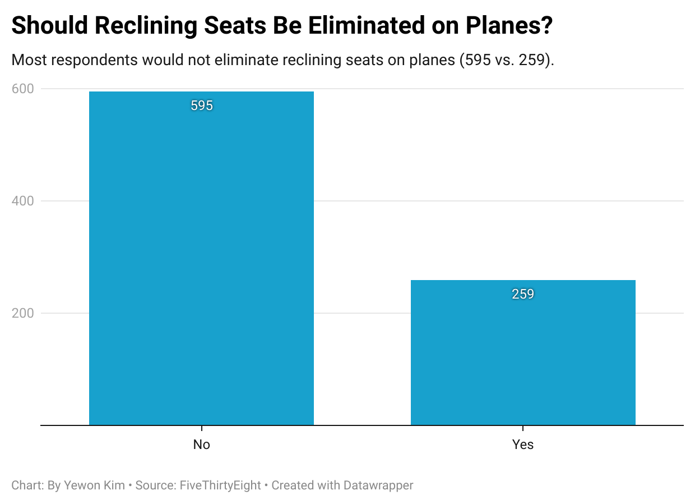

# JOURN 124 
## Week 4 Quiz, Question 6

The question I picked was ***“Given the opportunity, would you eliminate the possibility of reclining seats on planes entirely?”*** from the dataset. I found this question to be interesting because responding *“Yes”* would mean the respondent is willing to sacrifice their own comfort to recline their seat, just so that other passengers don’t recline theirs. For instance, I examined in the dataset that just because a respondent thinks reclining seats on a plane is rude, that does not mean that they respond that reclining seats should be eliminated entirely. This is likely because many passengers recognize the certian level of comfort they receive from being able to recline their own seat, and wouldn’t want to take that away for their own benefit. 

My chart ***“Should Reclining Seats Be Eliminated on Planes?”*** shows that **595** respondents answered *“No,”* while **259** respondents answered *“Yes.”* This reveals that most respondents would not eliminate reclining seats on planes, likely due to the individual comfort they receieve from reclining their own seats. 

